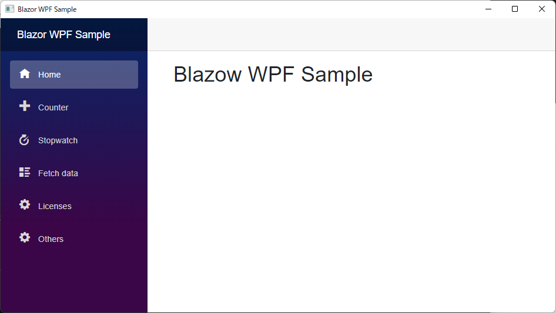

# Blazor Samples

## Requirements
- [.NET 7.0](https://dotnet.microsoft.com/ja-jp/download/dotnet/7.0)

## Build and Run
```
> dotnet --version
7.0.101
> cd BlazorWpfSample/BlazorWpfApp
> dotnet run --configuration Release
```




